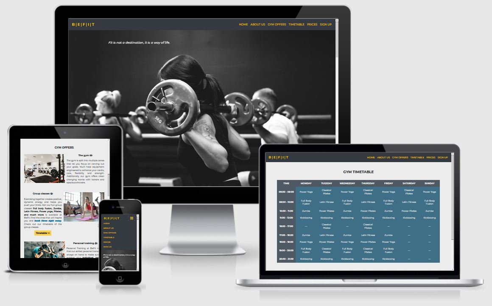

## Contents
- [Befit gym website](#befit-gym-website)
- [UX](#ux)
- [Technologies Used](#technologies-used)
- [Testing](#testing)
- [Deployment](#deployment)
- [Credits](#credits)

# Befit gym website
Befit gym website is a responsive web application built using HTML and CSS. It was created to demonstrate my front-end skills for Milestone Project 1 of Code Institute’s Full Stack Developer course.

# UX

## Who is this website for?
The target audience are gym members or potential members.

## What it is that they want to achieve?
There are 2 main purposes for visiting the website:
- learn more about the gym and its service
- be able to sign up for one of the options the gym offers.

## How does the project fulfil the users’ needs?
By providing all necessary information and features. Implemented user requirements are listed below in the User Stories section.

## Wireframes
Before starting the actual development, the [wireframes](https://github.com/AnaStasia1331/ms1-befit/tree/master/assets/images/readme-images/befit-wireframes.pdf) were created using Balsamiq tool. They give an initial idea of how the structure and content for the Home and Timetable pages would look like.

## User Stories 
As a website user, I want to:

1. navigate throughout the gym site with intuitive web design and clearly defined main sections.
2. learn about gym's purpose/goals and main features.
3. familiar with the activities the gym offers.
4. be aware of prices asked for the gym offers.
5. be able to sign up for gym membership or just a single visit.
6. be able to look up the schedule of the group classes.
7. know about the gym working hours, contact information and location.
8. access the gym's social media links so that I can see their followings and subscribe to the news.  
9. be able to come back to the Home page from any other website page.
10. use the website on mobile, tablet or desktop with equally good experience on all devices.
11. be able to understand the content of the site using a screen reader.
12. the website pages are loaded without significant delays.

# Technologies Used

In this section, you should mention all of the languages, frameworks, libraries, and any other tools that you have used to construct this project. For each, provide its name, a link to its official site and a short sentence of why it was used.

- [JQuery](https://jquery.com)
    - The project uses **JQuery** to simplify DOM manipulation.

# Testing

In this section, you need to convince the assessor that you have conducted enough testing to legitimately believe that the site works well. Essentially, in this part you will want to go over all of your user stories from the UX section and ensure that they all work as intended, with the project providing an easy and straightforward way for the users to achieve their goals.

Whenever it is feasible, prefer to automate your tests, and if you've done so, provide a brief explanation of your approach, link to the test file(s) and explain how to run them.

For any scenarios that have not been automated, test the user stories manually and provide as much detail as is relevant. A particularly useful form for describing your testing process is via scenarios, such as:

1. Contact form:
    1. Go to the "Contact Us" page
    2. Try to submit the empty form and verify that an error message about the required fields appears
    3. Try to submit the form with an invalid email address and verify that a relevant error message appears
    4. Try to submit the form with all inputs valid and verify that a success message appears.

In addition, you should mention in this section how your project looks and works on different browsers and screen sizes.

You should also mention in this section any interesting bugs or problems you discovered during your testing, even if you haven't addressed them yet.

If this section grows too long, you may want to split it off into a separate file and link to it from here.

# Deployment

This section should describe the process you went through to deploy the project to a hosting platform (e.g. GitHub Pages or Heroku).

In particular, you should provide all details of the differences between the deployed version and the development version, if any, including:
- Different values for environment variables (Heroku Config Vars)?
- Different configuration files?
- Separate git branch?

In addition, if it is not obvious, you should also describe how to run your code locally.

# Credits

### Content
- The text for section Y was copied from the [Wikipedia article Z](https://en.wikipedia.org/wiki/Z)

### Media
- The photos used in this site were obtained from ...

### Acknowledgements

- I received inspiration for this project from X